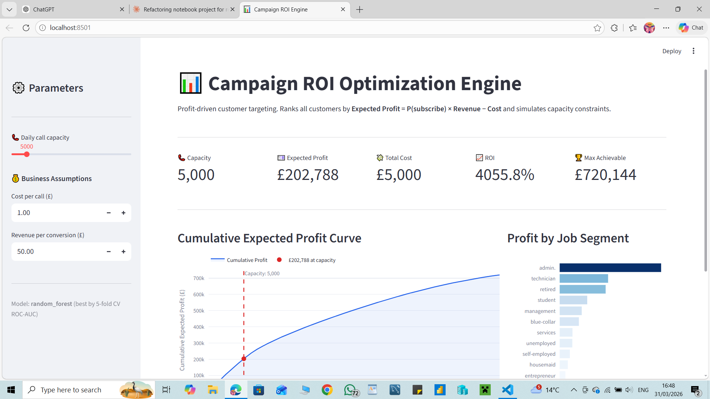
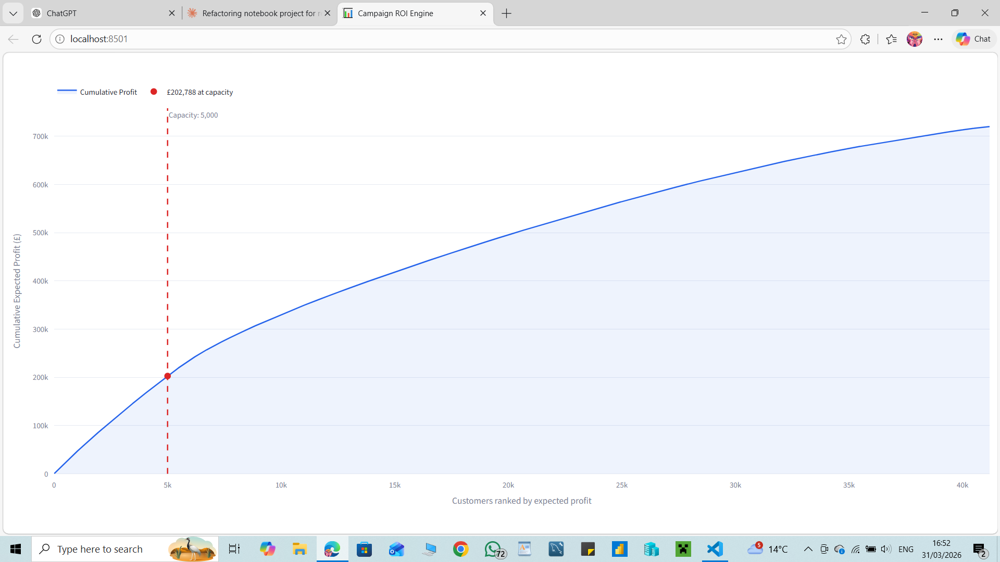
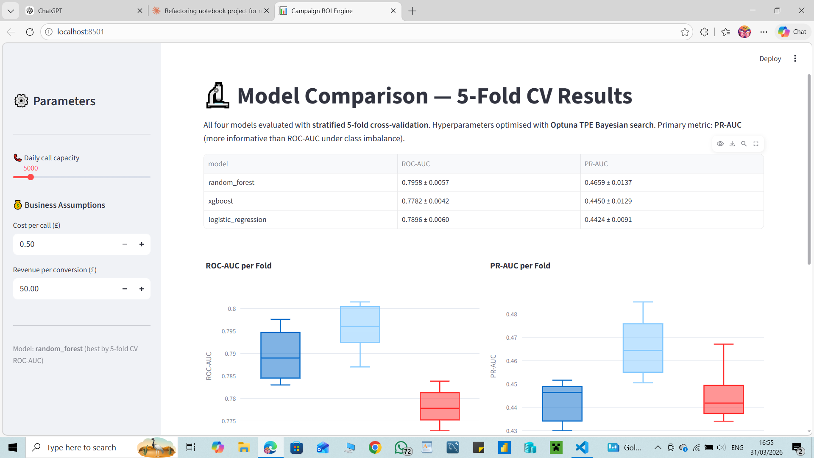
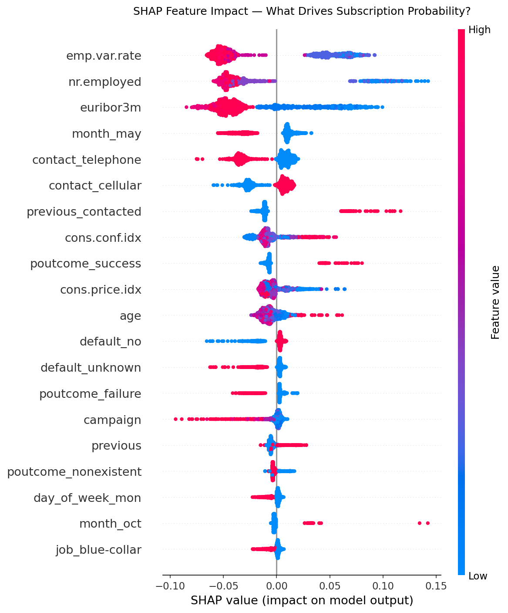
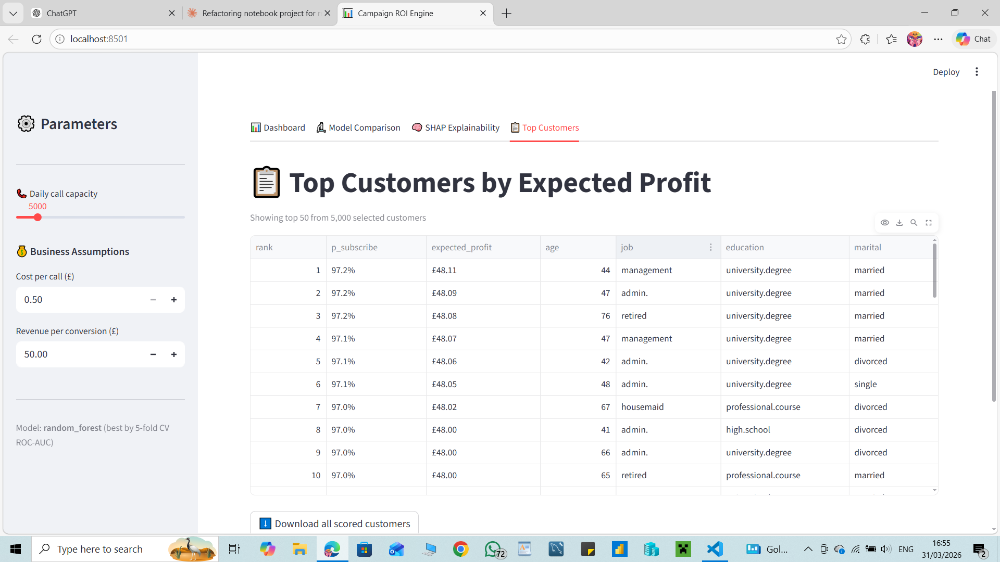

# 📊 Campaign ROI Optimization Engine

> **Profit-driven customer targeting for bank telemarketing campaigns.**  
> Transforms binary classification into decision optimisation under operational constraints.

[](https://python.org)
[](https://scikit-learn.org)
[](https://xgboost.readthedocs.io)
[](https://lightgbm.readthedocs.io)
[](https://optuna.org)
[](https://streamlit.io)

---

## Problem Statement

A Portuguese bank runs outbound telephone campaigns to sell term deposits. The team has a **fixed daily call capacity** — they can't call everyone. A naive approach predicts who subscribes. But that ignores the economics.

**This project answers the real operational question:**  
*Given N calls per day, which customers do we contact to maximise expected profit?*

```
Expected Profit = P(subscribe) × Revenue − Cost
```

Customers are ranked by expected profit. The interactive Streamlit dashboard lets operators simulate any call capacity and instantly see total profit, ROI, and which customers to prioritise.

---

## Results

### Model Comparison — 5-Fold Stratified CV

| Model | ROC-AUC | PR-AUC |
|---|---|---|
| **Random Forest** | **0.7958 ± 0.0057** | **0.4659 ± 0.0137** |
| Logistic Regression | 0.7896 ± 0.0060 | 0.4424 ± 0.0091 |
| XGBoost | 0.7782 ± 0.0042 | 0.4450 ± 0.0129 |

> Models tuned with **Optuna Bayesian search** (50 trials, TPE sampler). Best model selected by PR-AUC — more informative than ROC-AUC under class imbalance (11.3% positive rate).

### Best Model — Hold-Out Test Set (Random Forest)

| Metric | Score |
|---|---|
| ROC-AUC | 0.8133 |
| PR-AUC | 0.4895 |
| Brier Score | 0.1469 |

### Business Impact — Precision@K

| Calls | Conversions | Precision | Lift vs Random |
|---|---|---|---|
| Top 500 | 427 | 85.4% | **7.6x** |
| Top 1,000 | 770 | 77.0% | **6.8x** |
| Top 2,000 | 1,355 | 67.8% | **6.0x** |
| Top 5,000 | 2,468 | 49.4% | **4.4x** |
| Random baseline | — | 11.3% | 1.0x |

> Calling the top 1,000 ranked customers achieves **77% conversion precision — 6.8× better than random**

### Profit Simulation

| Daily Calls | Expected Profit | ROI |
|---|---|---|
| 1,000 | £45,796 | 4,580% |
| 2,500 | £108,119 | 4,325% |
| 5,000 | £202,788 | 4,056% |
| 10,000 | £330,217 | 3,302% |
| 20,000 | £495,447 | 2,477% |

---

## Screenshots

### Interactive Dashboard


### Profit Curve — Diminishing Returns


### Model Comparison — 5-Fold CV


### SHAP Explainability — What Drives Conversions




### Top Customers by Expected Profit


---

## SHAP Feature Importance

| Rank | Feature | Business Meaning |
|---|---|---|
| 1 | emp.var.rate | Employment variation rate — macroeconomic climate |
| 2 | nr.employed | Number employed — labour market health |
| 3 | euribor3m | 3-month Euribor rate — interest rate environment |
| 4 | month_may | May seasonality — campaign timing |
| 5 | contact_telephone | Contact method — telephone vs cellular |
| 6 | previous_contacted | Was customer contacted in a prior campaign? |
| 7 | cons.conf.idx | Consumer confidence index |
| 8 | poutcome_success | Previous campaign outcome |

> **Key insight:** Macroeconomic conditions dominate individual customer features. The *when* of the campaign matters more than the *who* — when employment is low and interest rates are falling, subscription rates rise regardless of customer profile.

---

## Project Structure

```
bank-roi-engine/
├── src/
│   └── bank_roi/
│       ├── config.py               # YAML config loader
│       ├── data/
│       │   └── loader.py           # load_raw, engineer_features, split
│       ├── models/
│       │   ├── factory.py          # Pipeline builder — LR / RF / XGBoost / LightGBM
│       │   └── tuner.py            # Optuna Bayesian hyperparameter search
│       ├── evaluation/
│       │   └── metrics.py          # 5-fold CV, hold-out metrics, summary table
│       ├── optimization/
│       │   └── profit.py           # score_customers, profit_at_capacity, profit_curve
│       ├── explainability/
│       │   └── shap_analysis.py    # SHAP TreeExplainer, beeswarm, feature importance
│       └── train.py                # CLI entrypoint
├── notebooks/
│   └── research.ipynb              # EDA → modelling → profit analysis
├── tests/
│   └── test_core.py                # Pytest unit tests
├── configs/
│   └── config.yaml                 # All hyperparameters and business assumptions
├── outputs/                        # Generated artefacts (gitignored)
├── app.py                          # Streamlit dashboard (4 tabs)
└── pyproject.toml
```

---

## Quickstart

```bash
# 1. Clone and install
git clone https://github.com/yourname/bank-roi-engine.git
cd bank-roi-engine
pip install pandas numpy scikit-learn xgboost lightgbm optuna shap streamlit plotly pyyaml joblib pytest

# 2. Download data
# Place bank-additional-full.csv at:
# data/raw/bank-additional/bank-additional-full.csv
# Dataset: https://archive.ics.uci.edu/dataset/222/bank+marketing

# 3. Set Python path
export PYTHONPATH=$(pwd)/src          # Mac/Linux
$env:PYTHONPATH = "$(pwd)\src"        # Windows PowerShell

# 4. Train — full pipeline with Optuna + SHAP (~20 mins)
python src/bank_roi/train.py

# 5. Or quick run — skip tuning and SHAP (~3 mins)
python src/bank_roi/train.py --skip-tuning --skip-shap

# 6. Launch the dashboard
python -m streamlit run app.py

# 7. Run tests
pytest tests/ -v
```

---

## Key Design Decisions

**Why drop `duration`?**  
Call duration is only known after the call ends — using it at prediction time causes target leakage, inflating metrics without real-world utility.

**Why PR-AUC over ROC-AUC as primary metric?**  
With 11.3% positive rate, ROC-AUC is misleadingly optimistic. PR-AUC focuses on the minority positive class and reflects real precision/recall trade-offs under imbalance.

**Why Optuna over GridSearchCV?**  
Optuna uses Bayesian TPE sampling — smarter than random or grid search. It finds better hyperparameters in fewer trials and includes Hyperband pruning to stop bad trials early.

**Why SHAP?**  
SHAP gives each feature a theoretically grounded contribution to every individual prediction. It answers the business question: *"Why did we rank this customer at position 12 instead of 500?"* — something feature importance rankings can't do.

**Why sklearn Pipelines?**  
Ensures preprocessing (scaling, encoding) is fitted only on training folds during cross-validation, preventing data leakage across folds.

**Why YAML config?**  
All hyperparameters and business assumptions live in `configs/config.yaml`. Nothing is hardcoded. Changing cost-per-call or revenue-per-conversion requires editing one file.

---

## Tech Stack

`Python 3.10+` · `pandas` · `scikit-learn` · `XGBoost` · `LightGBM` · `Optuna` · `SHAP` · `Streamlit` · `Plotly` · `PyYAML` · `joblib` · `pytest`

---

## Dataset

[UCI Bank Marketing Dataset](https://archive.ics.uci.edu/dataset/222/bank+marketing) — Moro, S. et al. (2014). 41,188 records, 20 features. Direct marketing campaigns of a Portuguese banking institution.